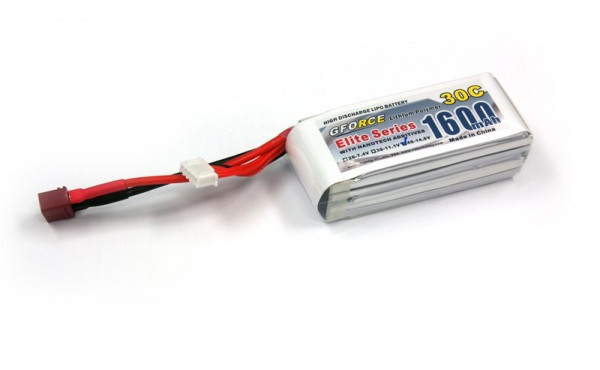
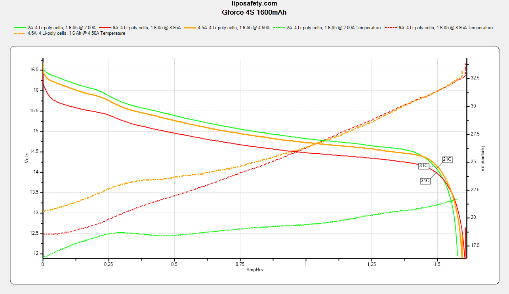
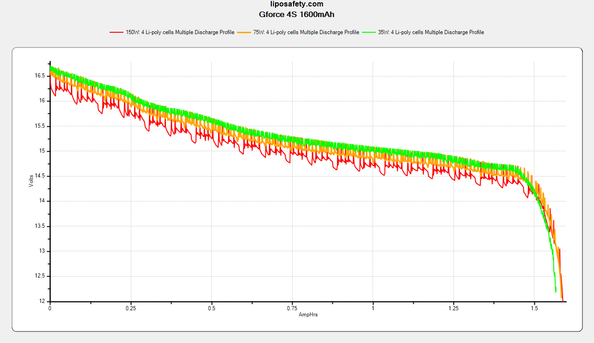

### Specifications

Part number: `FLM-LP-2930`

Discharge connector: Deans

Balance connector: 5-pin JST-XH

| Rated parameters     |                 |
| -------------------- | --------------- |
| Dimensions           | 35 x 27 x 85 mm |
| Continuous Discharge | 48A             |
| Capacity             | 1600mAh         |
| Nominal Voltage      | 14.8V           |
| Charge               | ?               |
| Weight               | 166g            |

| Derived parameters |          |
| ------------------ | -------- |
| Energy Capacity    | 23.68Wh  |
| Energy Density     | 513.5J/g |

| Observed parameters    |                  |
| ---------------------- | ---------------- |
| Dimensions             | 29.3 x 35 x 89mm |
| DC Internal Resistance | 10m&ohm;         |
| Capacity               | 1600mAh          |

### Photos

From the manufacturer: 

### Test Results

Continuous discharge: 

Vaping profiles: 

### Observations

The problem with this pack is its discharge leads. They are 16ga PVC jacketed wire. It would not be safe to draw more than ~20A from this pack even if it could deliver because the wire would be melting. Unless you are looking for a low-current purpose or are willing to open the pack up and re-wire it yourself, that alone should disqualify it from purchase.

I ran the 2A test and was surprised to find that I got almost 1550mAh out of it. I was even more surprised when I got 1606mAh out of it at 9A continuous.

Ultimately, I cannot recommend that anyone purchase this battery, because there is no way to safely test it anywhere near its discharge rating.
