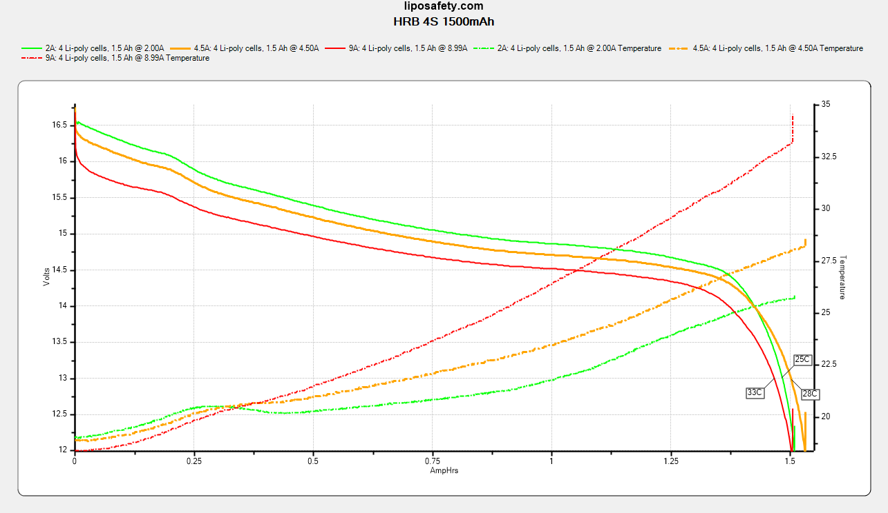

### Specifications

Part number: `?`

Discharge connector: XT60

Balance connector: 5-pin JST-XH

| Rated parameters     |                 |
| -------------------- | --------------- |
| Dimensions           | 34 x 29 x 90 mm |
| Continuous Discharge | 150A            |
| Capacity             | 1500mAh         |
| Nominal Voltage      | 14.8V           |
| Charge               | 1C              |
| Weight               | 173g            |

| Derived parameters |      |
| ------------------ | ---- |
| Energy Capacity    | ?Wh  |
| Energy Density     | ?J/g |

| Observed parameters    |             |
| ---------------------- | ----------- |
| Dimensions             | X x Y x Zmm |
| DC Internal Resistance | 20m&ohm;    |
| Capacity               | 1500mAh     |

### Photos

From the manufacturer: 

### Test Results

Continuous discharge: 

Vaping profiles: 

### Observations
