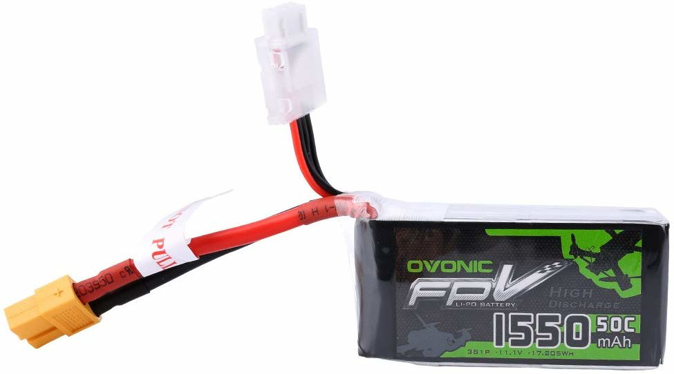
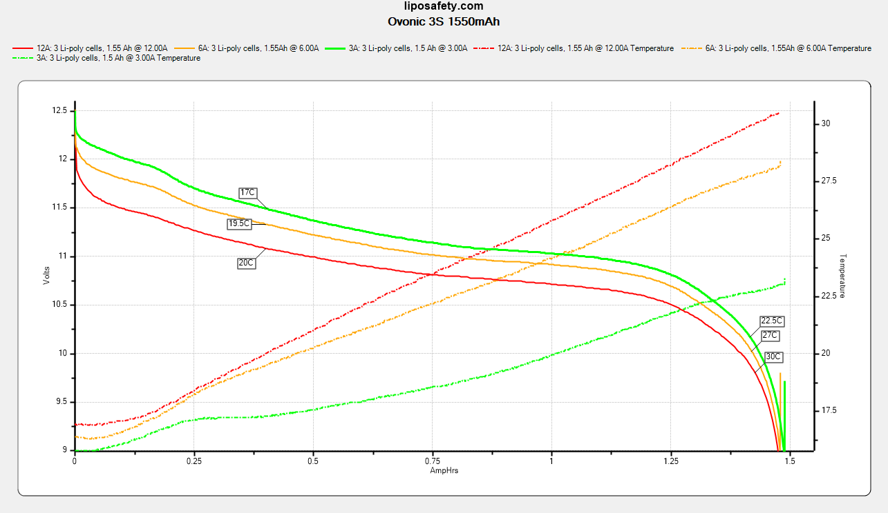
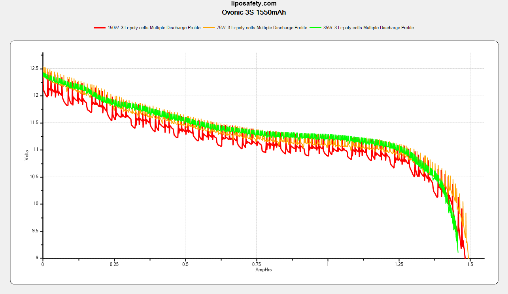

### Specifications

Part number: ?

Discharge connector: XT60

Balance connector: 4-pin JST-XH

| Rated parameters     |                |
| -------------------- | -------------- |
| Dimensions           | 32 x 20 x 69mm |
| Continuous Discharge | 77.5A          |
| Capacity             | 1550mAh        |
| Nominal Voltage      | 11.1V          |
| Charge               | 0.5-1C         |
| Weight               | 114g           |

| Derived parameters |          |
| ------------------ | -------- |
| Energy Capacity    | 17.2Wh   |
| Energy Density     | 483.8J/g |

| Observed parameters    |                 |
| ---------------------- | --------------- |
| Dimensions             | 35 x 23 x 71 mm |
| DC Internal Resistance | 25m&ohm;        |
| Capacity               | ~1450mAh        |

### Photos

From the manufacturer: 

### Test Results

Continuous discharge: 

Vaping profiles: 

### Observations

Both test packs I have are roughly 3 x 3 x 2 mm larger than stated, measured fresh out of the box. They averaged 1450mAh across the continuous discharge and vaping profile tests. Accordingly, I find that these packs are roughly 8% over-rated with respect to capacity. At higher discharge rates, the packs did heat up roughly 10&deg;C, but they stayed at safe temperatures up to 12A continuous discharge.
