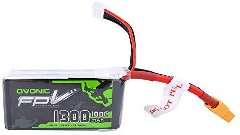
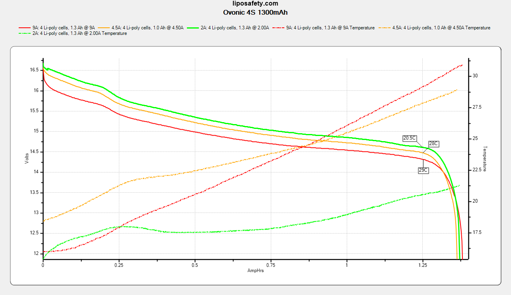
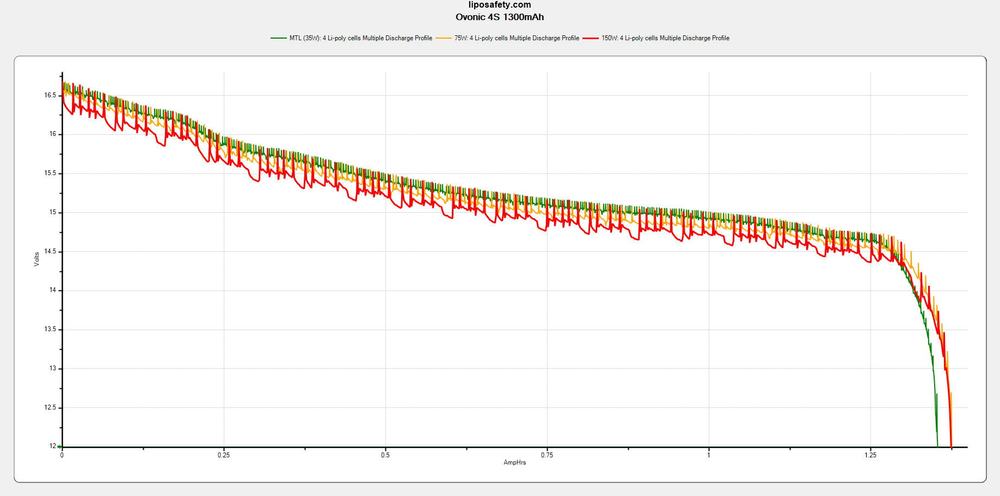

### Specifications

Part number: `B420 YS1300-4S-XS-US`

Dimensions: 31 x 34 x 72 mm

Discharge connector: XT60

Balance connector: 5-pin JST-XH

| Rated parameters     |                |
| -------------------- | -------------- |
| Dimensions           | 31 x 34 x 72mm |
| Continuous Discharge | 91A            |
| Capacity             | 1300mAh        |
| Nominal Voltage      | 14.8V          |
| Charge               | <2C            |
| Weight               | 155g           |

| Derived parameters |          |
| ------------------ | -------- |
| Energy Capacity    | 19.24Wh  |
| Energy Density     | 446.9J/g |

| Observed parameters    |                |
| ---------------------- | -------------- |
| Dimensions             | 32 x 34 x 76mm |
| DC Internal Resistance | 6m&ohm;        |
| Capacity               | ~1200mAh       |

### Photos

From the manufacturer: 

### Test Results

Continuous discharge: 

Vaping profiles: 

### Observations

These packs seem to be under-rated in terms of capacity - it was not uncommon to get 1350 or 1375 mAh from them. They handled up to 10A discharge well, with no swelling and expected heating to ~30&deg;C.
