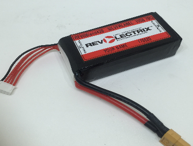
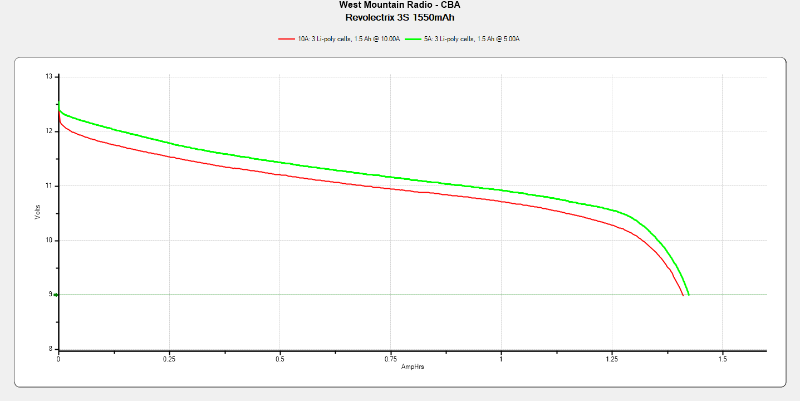

# Revolectrix 3S 1550mAh

### Specifications

Part number: `B420 YS1550-3S-XS`

Dimensions: 20 x 45 x 90 mm

Discharge connector: XT60

Balance connector: 4-pin JST-XH

| Rated parameters     |         |
| -------------------- | ------- |
| Continuous Discharge | 108.5A  |
| Capacity             | 1550mAh |
| Nominal Voltage      | 11.1V   |
| Charge               | 1-3C    |
| Weight               | 165g    |

| Derived parameters |          |
| ------------------ | -------- |
| Energy Capacity    | 17.21Wh  |
| Energy Density     | 375.4J/g |

| Observed parameters    |          |
| ---------------------- | -------- |
| DC Internal Resistance | ~6m&ohm; |
| Capacity               | ~1400mAh |

### Photos

From the manufacturer: 

### Test Results

Test results yield an average of 1400mAh per pack. Accordingly, I assert that these packs are roughly 10% over-rated with respect to capacity.

### Observations

The packs tested heated to ~25&deg;C and swelled visibly after a minute at 10A constant discharge.
