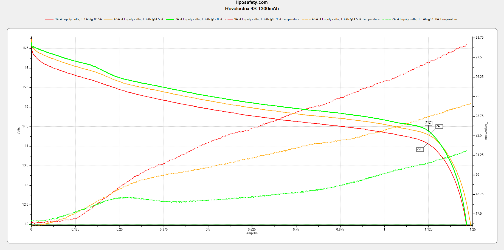
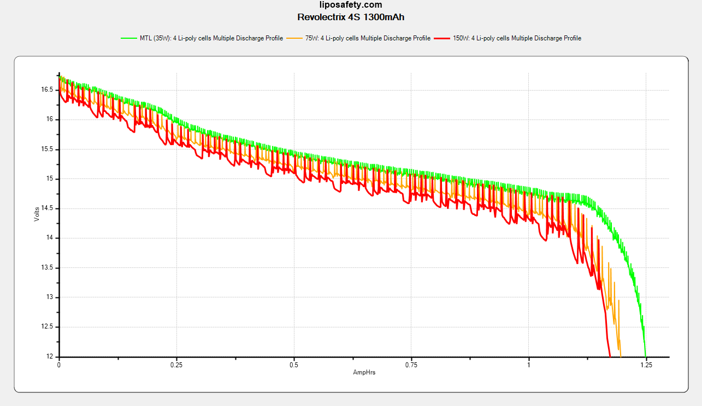

# Revolectrix 4S 1300mAh

### Specifications

Part number: `B420 YS1300-4S-XS-US`

Dimensions: 31 x 34 x 72 mm

Discharge connector: XT60

Balance connector: 5-pin JST-XH

| Rated parameters     |                |
| -------------------- | -------------- |
| Dimensions           | 31 x 34 x 72mm |
| Continuous Discharge | 91A            |
| Capacity             | 1300mAh        |
| Nominal Voltage      | 14.8V          |
| Charge               | <2C            |
| Weight               | 155g           |

| Derived parameters |          |
| ------------------ | -------- |
| Energy Capacity    | 19.24Wh  |
| Energy Density     | 446.9J/g |

| Observed parameters    |                |
| ---------------------- | -------------- |
| Dimensions             | 32 x 34 x 76mm |
| DC Internal Resistance | 3-8m&ohm;      |
| Capacity               | ~1200mAh       |

### Photos

From the manufacturer: 

### Test Results

Continuous discharge: 

Vaping profiles: 

Continuous discharge testing yield an average of 1200mAh per pack. Accordingly, I assert that these packs are roughly 8% over-rated with respect to capcity.

At MTL wattages, these packs were able to deliver 1290mAh - within the margin of error for my testing setup. However, at 75/150W they were closer to 1150mAh.

### Observations

These packs handle 10A continuous discharge well, no observed swelling and only a 4-5&deg;C temperature increase. Unfortunately, I will have to update this when I can test at >10A.
